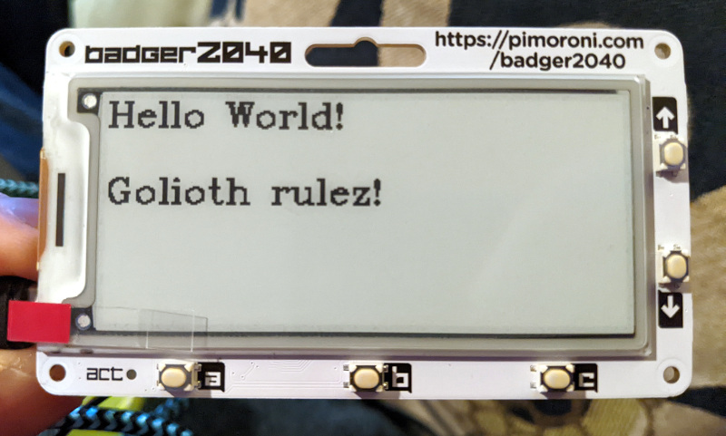

# Ostentus

Use a Pimoroni Badger ePaper display as an i2c-controlled display for Golioth
Reference Designs.

## Installation

Load [version 1.18.3 of the Badger2040 micropython
build](https://github.com/pimoroni/pimoroni-pico/releases/tag/v1.18.3). The
badge will enumerate as USB mass storage when the Boot button is held while
reset is pressed and released. Copy the python file onto the drive and it will
automatically flash and reboot.

Use Thonny to put the i2cperipheral.mpy and ostentus.py files on the Badger.
When issuing the following command, the Badger will return `Listening...` to
indicate the i2c-peripheral is running:

```
import ostentus
```

## Controlling Ostentus

Use any i2c-controller to write to the display on device-address 0x12.

Memory register map:

* 0x00: clear display framebuffer memory
  * Register value: 1-byte (0x01 == refresh display, anything else is clear
    memory without refreshing the display)
* 0x01: refresh display from memory
  * Register value: 1-byte for [Badger update speed](https://github.com/pimoroni/pimoroni-pico/tree/main/micropython/modules/badger2040#update-speed-1)
  * 0x00: UPDATE_NORMAL
  * 0x01: UPDATE_MEDIUM
  * 0x02: UPDATE_FAST
  * 0x03: UPDATE_TURBO
* 0x02: update the starting column (x_loc: 0..295)
* 0x03: update the starting row (y_loc: 0..127)
* 0x04: show splashscreen
* 0x20: memory for line 0 on the display (starting from x_loc column)
* ...
* 0x26: memory for line 6 on the display (starting from x_loc column)

The font used is not monospace, so the 32 character max is a memory limit, not
an indication of what will fit on the display.

## Example:

Using micropython on a Raspberry Pi Pico:

```python
>>> i2c.scan()
[18]
>>> i2c.writeto_mem(0x12, 0x20, "Hello World!")
>>> i2c.writeto_mem(0x12, 0x22, "Golioth rulez!")
>>> i2c.writeto_mem(0x12, 0x01, b'\x00')
```

This example scans for and prints out the ostentus i2c device (address 0x12)
before writing to lines 0 and 2 in memory and using a full refresh to show those
values on the display.



## i2cperipheral micropython library

This is based on the [i2cperipheral library for the
RP2040](https://github.com/adamgreen/i2cperipheral). The .mpy file that is
included in this library is too old for the Badger2040 build. Use the following
steps to build a more modern version:

1. Clone the i2cperipheral repo
2. Run `make init` to initialize the library
3. Enter the `micropython` library and run `git stash`
4. Use `git checkout v1.18.3` to check out the correct version
5. Go back to the i2cperipheral directory and run `make init`
6. Run `make` to build i2cperipheral.mpy which can be placed on the Badger2040
